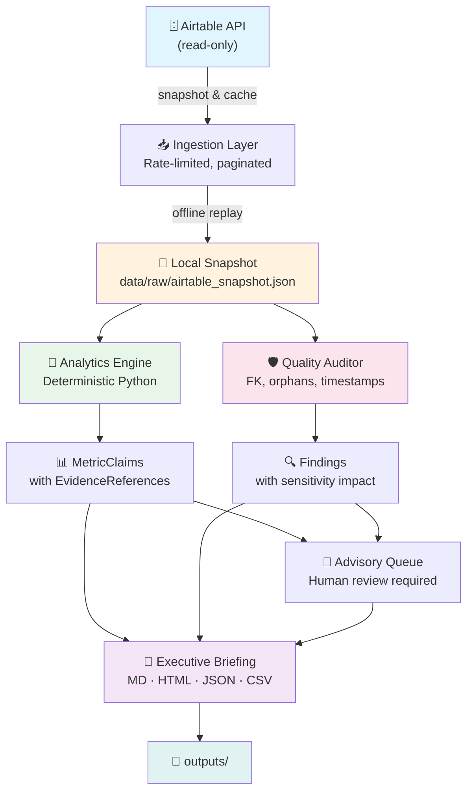

# 🎯 Recruitment Intelligence

> **An evidence-backed founder operating system for hiring.**
> Turn your Airtable recruitment data into deterministic analytics, advisory candidate actions, and daily executive briefings — without writing a single line of code.

[](LICENSE)
[](https://python.org)
[](tests/)
[](#offline-first)
[](#use-with-ai-coding-agents)

---

## 🚀 What is this?

**Recruitment Intelligence** connects to your Airtable recruitment data (read-only) and produces:

| Output | Description |
|--------|-------------|
| 📊 **Source Effectiveness Rankings** | Which recruiting channels actually produce hires vs. waste pipeline effort |
| 📈 **Offer Acceptance Rate** | With explicit denominator justification (not vanity metrics) |
| 🔍 **Funnel Bottleneck Diagnosis** | Stage-by-stage conversion rates, aging analysis, and stalled application detection |
| 🛡️ **Data Quality Audit** | Missing foreign keys, orphaned records, timestamp contradictions, unmapped values |
| 📋 **Advisory Candidate Action Queue** | `review` · `advance` · `escalate` · `request feedback` · `close` — never automated rejections |
| 📝 **Daily Executive Briefing** | Markdown, HTML, JSON, and CSV artifacts ready for your morning standup |

Every metric includes structured evidence (source table, record IDs, confidence level, caveats). Nothing is invented or hallucinated.

---

## 🏗️ Architecture



### Layer Boundaries

| Layer | Path | Responsibility | LLM? |
|-------|------|---------------|-------|
| **Domain** | `src/.../domain/` | Typed contracts, enums, validation | ❌ Never |
| **Airtable** | `src/.../airtable/` | Read-only ingestion, caching, schema profiling | ❌ Never |
| **Analytics** | `src/.../analytics/` | Deterministic metrics (Q1–Q4) | ❌ Never |
| **Quality** | `src/.../quality/` | Data quality checks & sensitivity (Q5) | ❌ Never |
| **Agents** | `src/.../agents/` | Advisory actions, mock/Gemini provider | ✅ Optional |
| **Outputs** | `src/.../outputs/` | Briefing rendering, memo, cost appendix | ❌ Never |

> **Core analytics never call an LLM.** The optional agent layer interprets validated outputs only.

---

## 🤖 Use with AI Coding Agents

**This repo is designed to be used by non-developers through AI coding agents.** Fork it, set your credentials, and tell your AI agent to run it.

### Supported Agents

| Agent | How to use |
|-------|-----------|
| **[Google Antigravity (AGY)](https://cloud.google.com/antigravity)** | Open workspace → paste quickstart prompt |
| **[Claude Code](https://docs.anthropic.com/en/docs/claude-code)** | `claude` in terminal → paste quickstart prompt |
| **[OpenAI Codex CLI](https://github.com/openai/codex)** | `codex` in terminal → paste quickstart prompt |
| **[Cursor](https://cursor.sh)** | Open folder → Cmd+K → paste quickstart prompt |
| **[GitHub Copilot Workspace](https://githubnext.com/projects/copilot-workspace)** | Open repo → describe task |

### Quickstart Prompt (paste this into any AI agent)

```
I have Airtable recruitment data. Set up this project:

1. Create a Python virtual environment and install dependencies
2. Create a .env file with these credentials:
   AIRTABLE_API_KEY=<my key>
   AIRTABLE_BASE_ID=<my base id>
3. Pull a live snapshot from Airtable
4. Run the full recruitment intelligence pipeline
5. Show me the executive briefing from outputs/briefing.md
```

> 📖 **See [QUICKSTART.md](QUICKSTART.md) for the full zero-code guide.**

---

## ⚡ Quick Start (Developer)

### Prerequisites

- Python 3.11+
- An Airtable base with recruitment tables (Departments, People, Job Openings, Candidates, Applications, Interviews, Offers, Findings)

### Install

```bash
git clone https://github.com/abluvsu/recruitment-intelligence.git
cd recruitment-intelligence
python -m venv .venv

# Windows
.\.venv\Scripts\Activate.ps1

# macOS/Linux
source .venv/bin/activate

pip install -e ".[dev]"
```

### Configure

```bash
cp .env.example .env
# Edit .env with your Airtable credentials:
#   AIRTABLE_API_KEY=pat_xxxxxxxxxxxxx
#   AIRTABLE_BASE_ID=appXXXXXXXXXXXXXX
```

### Run

```bash
# Run with live Airtable data using AIRTABLE_API_KEY and AIRTABLE_BASE_ID from .env
python -m recruitment_intelligence.pipeline --live --output-dir outputs/live

# Pin the analysis date for reproducible live reports
python -m recruitment_intelligence.pipeline --live --as-of 2025-02-01 --output-dir outputs/live

# Run offline with synthetic fixtures (no credentials needed)
python -m recruitment_intelligence.pipeline fixtures/clean_snapshot.json --output-dir outputs/demo

# Run tests
python -m pytest -q
```

### Output

```
outputs/
├── briefing.md              # Executive daily briefing (Markdown)
├── briefing.html            # Executive daily briefing (HTML)
├── briefing.json            # Full structured briefing with evidence
├── candidate_actions.json   # Advisory action queue
├── findings.md              # Validated findings memo
├── findings.csv             # Findings in tabular format
├── findings.json            # Findings with evidence blocks
└── memo.md                  # One-page recruitment intelligence memo
```

---

## 🔒 Safety & Guardrails

| Guardrail | Enforcement |
|-----------|-------------|
| **Read-only Airtable access** | Only GET requests; zero writes/mutations |
| **Rate limiting** | Max 5 req/sec with exponential backoff |
| **No credential leaks** | API keys never logged, printed, or committed |
| **Advisory-only actions** | `review`, `advance`, `escalate`, `request feedback`, `close` |
| **Human review required** | Every candidate recommendation enforces `requires_human_review=True` |
| **Evidence-backed claims** | Every metric includes source table, record IDs, confidence, and caveats |
| **Insufficient data handling** | Returns `Unknown — insufficient evidence` instead of guessing |
| **Isolated cost research** | External benchmarks in a separate labeled appendix; never mixed with Airtable metrics |

---

## 📊 The Five Questions

This system deterministically answers five core executive questions:

### Q1: What data do we have?
Table-by-table record counts and schema profiling across all 8 Airtable tables.

### Q2: Which recruiting sources actually work?
Source effectiveness ranked by hire conversion yield vs. pipeline effort consumed. Identifies channels that generate interview/offer volume without producing hires.

### Q3: What is our offer acceptance rate?
Accepted offers ÷ total formal offers extended. Denominator explicitly excludes draft/rescinded offers with written justification.

### Q4: Where is the funnel broken?
Stage-to-stage pass-through conversion rates, application aging analysis, bottleneck stage identification, and detection of applications stalled ≥ 14 days.

### Q5: Can we trust the data?
Automated checks for missing foreign keys, orphaned records, timestamp contradictions, unmapped enum values, and counterfactual sensitivity analysis showing how data quality issues affect metrics.

---

## 🧪 Testing

```bash
# All 483 tests
python -m pytest -q

# Compile check
python -m compileall src tests
```

**Test tiers:**

| Tier | Scope | Count |
|------|-------|-------|
| **1** | Happy-path feature verification | ≥5 per feature |
| **2** | Boundaries, empty inputs, malformed dates | ≥5 per feature |
| **3** | Pairwise pipeline component combinations | ✓ |
| **4** | Realistic application scenarios | ≥4 scenarios |
| **5** | Adversarial stress testing | ✓ |

See [TEST_INFRA.md](TEST_INFRA.md) for the full test architecture.

---

## 📂 Project Structure

```
recruitment-intelligence/
├── src/recruitment_intelligence/
│   ├── domain/          # Typed contracts & validation
│   ├── airtable/        # Read-only ingestion & caching
│   ├── analytics/       # Deterministic metrics engine
│   ├── quality/         # Data quality audit & sensitivity
│   ├── agents/          # Advisory queue & LLM providers
│   ├── outputs/         # Briefing, memo, cost appendix
│   └── pipeline.py      # End-to-end orchestrator
├── tests/               # 483 tests across 5 tiers
├── fixtures/            # Synthetic test snapshots
├── scripts/             # Offline runner
├── docs/                # Architecture decisions
├── QUICKSTART.md        # Zero-code guide for non-developers
├── AGENTS.md            # AI agent contributor guide
├── PROJECT.md           # Full feature & milestone tracker
└── TEST_INFRA.md        # Test philosophy & coverage map
```

---

## 🔌 Offline First

The entire system runs offline by default:

- **Mock LLM provider** — no API keys needed for advisory generation
- **Synthetic fixtures** — `fixtures/clean_snapshot.json`, `dirty_snapshot.json`, `sparse_snapshot.json`
- **Cached snapshots** — live Airtable data is pulled once and replayed from disk
- **Zero network dependencies** — after initial snapshot, everything runs locally

```bash
# Runs 100% offline with zero credentials
python scripts/run_offline.py outputs/demo
```

---

## 📜 License

[MIT](LICENSE) — use it however you want.

---

## 🙏 Built With

This project was built entirely with [Google Antigravity](https://cloud.google.com/antigravity) using an iterative spec-first, test-driven development workflow. The planning artifacts (`ORIGINAL_REQUEST.md`, `PROJECT.md`, `docs/`) are included to showcase the AI-assisted development process.
